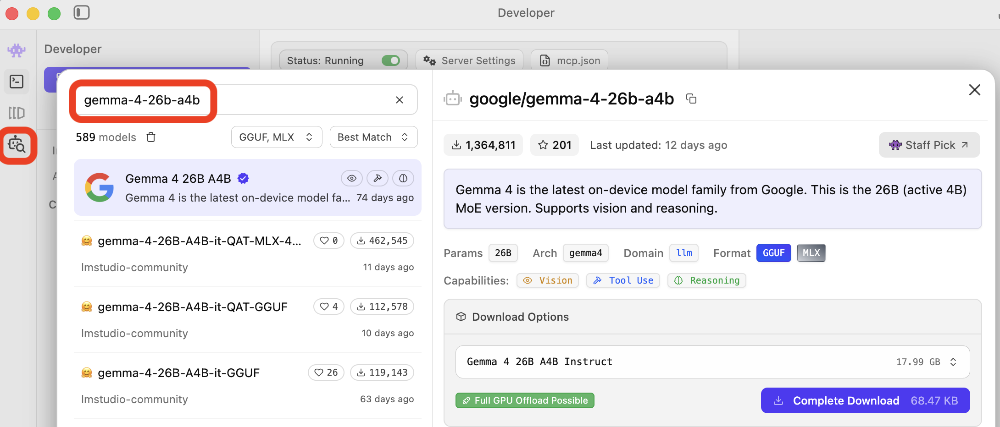
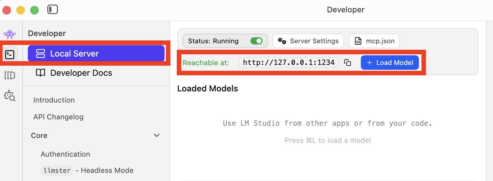
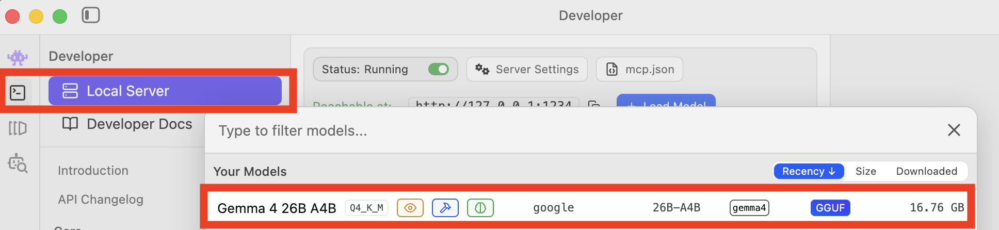
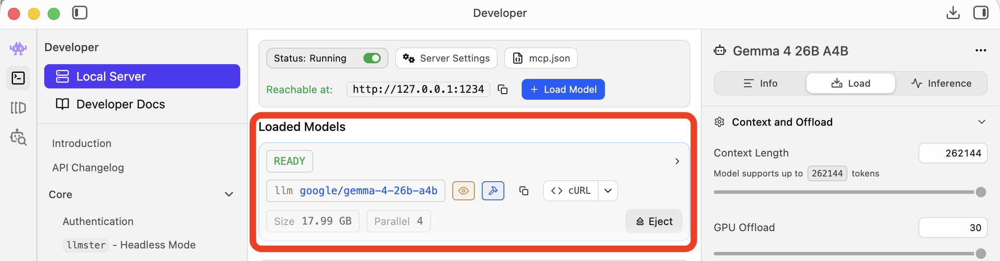
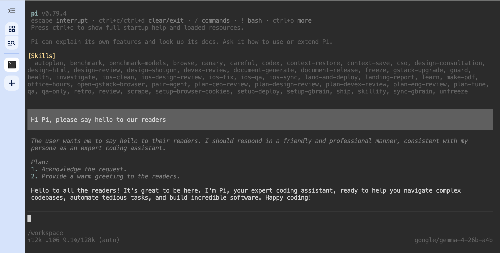

# Pi - Local Agent Harness

Run the [Pi](https://pi.dev/) agent harness locally in [Docker](https://www.docker.com/) and [LM Studio](https://lmstudio.ai/) via [ttyd](https://github.com/tsl0922/ttyd) in your browser - completely private and offline.

> [!NOTE]
> The procedure described below is intended and tested to work on a MacBook.
> 
> Adjust accordingly in case you run on another platform.

## Preconditions

- [Install Docker](https://docs.docker.com/get-started/get-docker/)
- [Install LM Studio](https://lmstudio.ai/)

## Configure LM Studio

After you have both Docker and LM Studio installed and running follow the setup procedure described below.

- Download a model from [Hugging Face](https://huggingface.co/) (i.e. [Gemma4](https://huggingface.co/collections/google/gemma-4))

#### Find a Model



#### Load the Model



#### Select the Model



#### Model Loaded and Serving




## Getting started

```bash
# Clone this repo
git clone https://github.com/danaschwanden/pi-ttyd.git

# Change to the repo folder
cd pi-ttyd

# Build the Docker image
./build.sh

# Run the Docker image - this will start on a new port for every run
./run.sh
```



## Optimise your Setup

Once you have your setup running you can optimise your your Pi agent harness by tuning the files in the [`agent folder`](./pi-data/agent) following the [Pi online docs](https://pi.dev/docs/latest).

For example you can change the Model configuration in the [`models.json`](./pi-data/agent/models.json) file.

## Workspace

Your Pi agent will mount the [`workspace`](./workspace) folder. This will allow you to share the artifacts between different agent instances as well as access them from your local machine.
